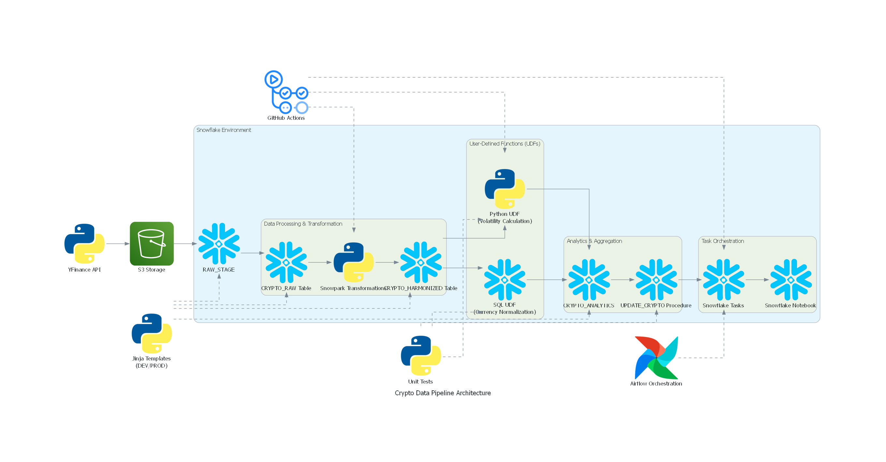

# 🚀 Cryptocurrency Data Pipeline with Snowflake & Snowpark

### **📄 Project Summary**  
Quickstart: https://neneanuj.github.io/Snowflake_DataPipeline/#

Youtube: 

## **📌 Overview**
This project builds an **incremental data pipeline** to ingest, transform, and analyze **cryptocurrency price data** (BTC, ETH, DOGE) using **Snowflake, Snowpark Python, and GitHub Actions**.

The system provides:
- Fetch **daily crypto prices** from **Yahoo Finance API**.
- Store raw data in **Snowflake staging tables**.
- Compute **daily & weekly returns** in **analytics tables**.
- Automate **data ingestion & processing** using **Snowflake Tasks**.
- Deploy & schedule workflows using **GitHub Actions & Snowflake Notebooks**.


---

## **✔ Technology Stack**

| **Technology** | **Purpose** |
|--------------|------------|
| **Snowflake** | Cloud Data Warehouse for storing & processing data |
| **Snowpark Python** | Enables Python-based data transformations within Snowflake |
| **Yahoo Finance API** | Fetches cryptocurrency market data |
| **CoinGecko API** | Alternative data source for real-time prices |
| **Snowflake Streams & Tasks** | Automates incremental data ingestion & transformation |
| **Stored Procedures (SQL & Python)** | Manages updates & analytics computations |
| **GitHub Actions** | CI/CD automation for Snowpark Python deployment |
| **Snowflake Notebooks** | Data exploration & transformations |
| **Jinja Templates** | Environment management for DEV & PROD |
| **Pytest** | Unit testing framework for data validation |
| **Pandas & NumPy** | Data transformation & analytics in Snowpark |
| **Matplotlib & Seaborn** | Data visualization for insights |

---

## **🛠️ Diagrams**




---

## **📂 Project Structure**
```plaintext
📦 Snowflake_DataPipeline
├── 📂 .devcontainer             # Development container setup
│   ├── Dockerfile
│   ├── config.toml
│   ├── connection.toml
│   ├── devcontainer.json
├── 📂 .github/workflows         # GitHub Actions CI/CD
│   ├── deploy.yml
├── 📂 docs                      # Documentation
│   ├── codelab.json
│   ├── codelab.md
│   ├── index.html
├── 📂 src                       # Source code for Snowflake ETL pipeline
│   ├── 📂 03_airflow             # Airflow orchestration scripts
│   │   ├── 03_api_transformation.py
│   ├── 📂 04_data_ingestion       # Data ingestion scripts
│   │   ├── data_ingestion/
│   │   │   ├── 04_load_crypto_data.py  # Loads crypto data
│   │   │   ├── .gitignore
│   │   │   ├── requirements.txt
│   │   │   ├── snowflake.yml
│   ├── 📂 05_data_harmonization   # Data transformation/harmonization
│   │   ├── data_harmonization/
│   │   │   ├── data_harmonization.py
│   │   │   ├── .gitignore
│   │   │   ├── requirements.txt
│   │   │   ├── snowflake.yml
│   ├── 📂 06_udf_crypto_volatility # User-defined functions (UDFs) for volatility calculations
│   │   ├── udf_crypto_volatility/
│   │   │   ├── __init__.py
│   │   │   ├── function.py
│   │   │   ├── .gitignore
│   │   │   ├── requirements.txt
│   │   │   ├── snowflake.yml
│   ├── 📂 07_create_view          # SQL scripts to create views
│   │   ├── create_view.py
│   ├── 📂 08_data_update          # Data update processing
│   │   ├── data_update/
│   │   │   ├── procedure.py       # Python stored procedure for updates
│   │   │   ├── .gitignore
│   │   │   ├── requirements.txt
│   │   │   ├── snowflake.yml
│   ├── 📂 09_orchestration        # Task orchestration & automation
│   │   ├── snowpark_notebook.ipynb  # Snowflake notebook for analysis
│   │   ├── tasks_setup.sql        # Snowflake Task setup scripts
├── 📂 environment_management      # Configuration & environment setup
│   ├── config.sql.j2              # Jinja template for Snowflake setup
│   ├── ender_config.sh            # Shell script to render templates
├── 📂 set_up                      # Snowflake database/schema setup
│   ├── 01_setup_snowflake.sql
│   ├── 02_raw_data_setup.py
│   ├── __init__.py
├── 📂 tests                       # Unit & Integration Tests
│   ├── test_procedures.py
│   ├── test_udfs.py
│   ├── test_udfs.sql
├── .gitignore                      # Git ignore file
├── AiUseDisclosure.md               # AI usage documentation
├── LICENSE                          # License file
├── README.md                        # Project Overview
├── config.sql.j2                     # Jinja template config
├── crypto_data.csv                   # Sample crypto dataset
├── crypto_data_pipeline_architecture.png  # Architecture diagram
├── dg.py                              # Additional documentation script
├── requirements.txt                    # Python dependencies


```

---

## **🚀 Installation & Setup**
1️⃣ Prerequisites
Ensure you have:

- **Python 3.8+**
- **Snowflake Account**
- **Git & GitHub**
- **Yahoo Finance API Access**

2️⃣ Clone the Repository
```
git clone https://github.com/Neneanuj/Snowflake_DataPipeline.git
cd Snowflake_DataPipeline
```

3️⃣ Create a Virtual Environment
```
python -m venv venv
source venv/bin/activate  # Mac/Linux
venv\Scripts\activate     # Windows

pip install -r requirements.txt
```

4️⃣ Configure Snowflake Credentials
Edit the config.py file:
```
SNOWFLAKE_ACCOUNT = "your_snowflake_account"
SNOWFLAKE_USER = "your_username"
SNOWFLAKE_PASSWORD = "your_password"
SNOWFLAKE_WAREHOUSE = "COMPUTE_WH"
SNOWFLAKE_DATABASE = "CRYPTO_DB"
SNOWFLAKE_SCHEMA = "RAW_CRYPTO"
```
---

## **🛠️ Usage**

---


## **📌 Expected Outcomes**

✅ **Fully functional, automated cryptocurrency data pipeline** built on **Snowflake & Snowpark**.  
✅ **Daily ingestion of cryptocurrency prices (BTC, ETH, DOGE)** using **Yahoo Finance API**.  
✅ **Incremental updates** using **Snowflake Streams, Tasks, and Stored Procedures**.  
✅ **Precomputed analytics tables** with **daily & weekly return metrics**.  
✅ **Snowflake Notebooks** for **data exploration & analytics processing**.  
✅ **Continuous Integration & Deployment (CI/CD)** with **GitHub Actions**.  
✅ **Unit tests** to validate **UDFs, transformations, and pipeline correctness**.  
✅ **Environment management with Jinja-based templates** for **DEV & PROD**.  

---

## **📌 AI Use Disclosure**

📄 See AiUseDisclosure.md for details.

---

## **👨‍💻 Authors**
* Sicheng Bao (@Jellysillyfish13)
* Yung Rou Ko (@KoYungRou)
* Anuj Rajendraprasad Nene (@Neneanuj)

---

## **📞 Contact**
For questions, reach out via Big Data Course or open an issue on GitHub.
